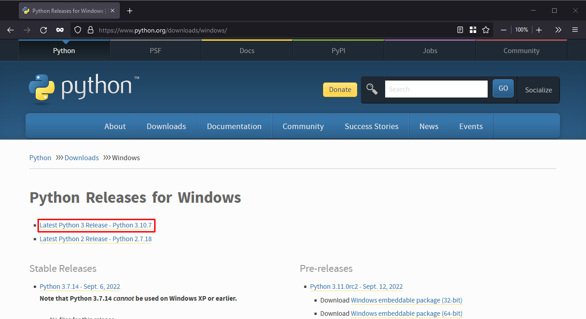
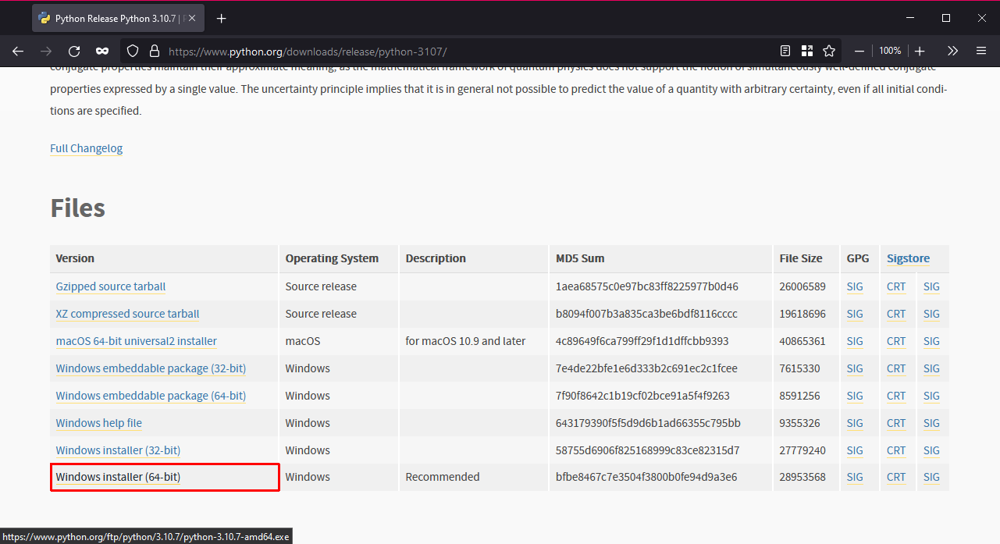
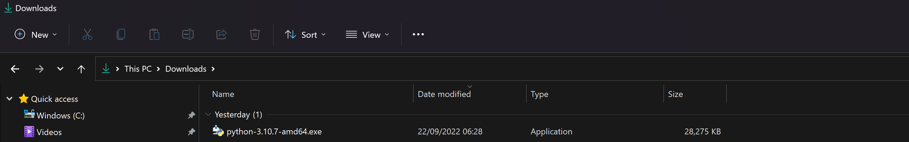
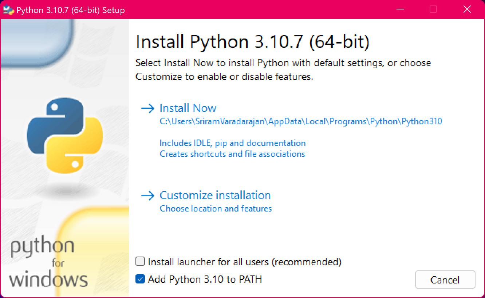
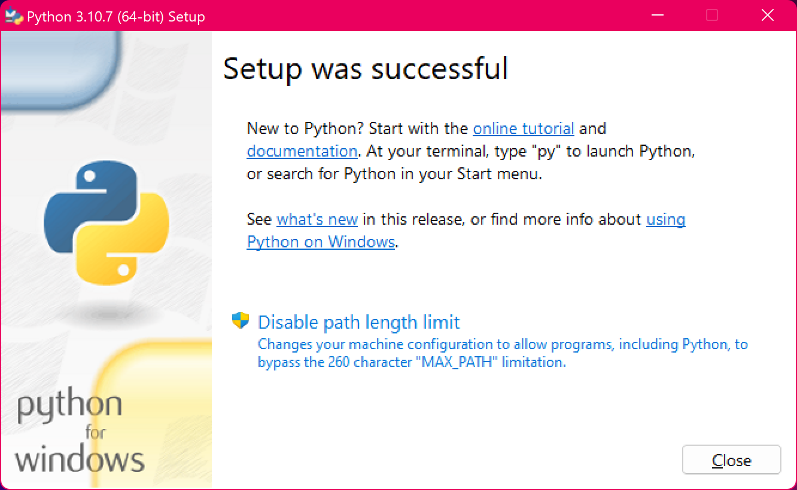
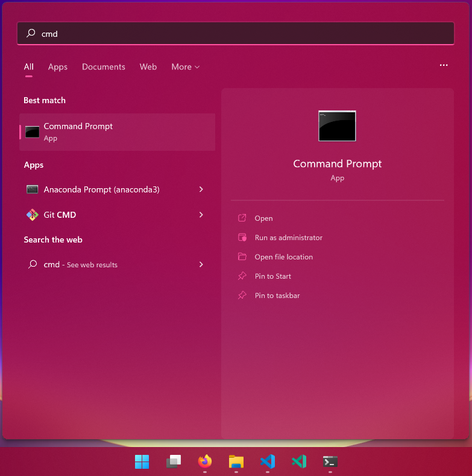
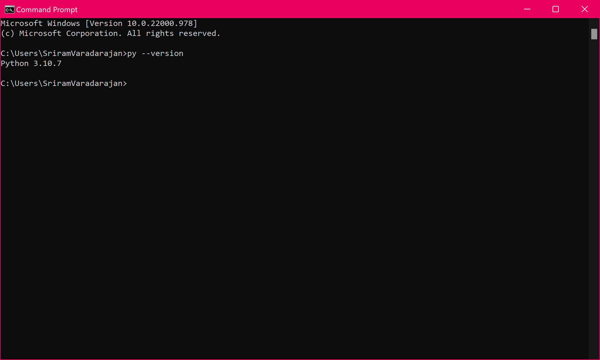
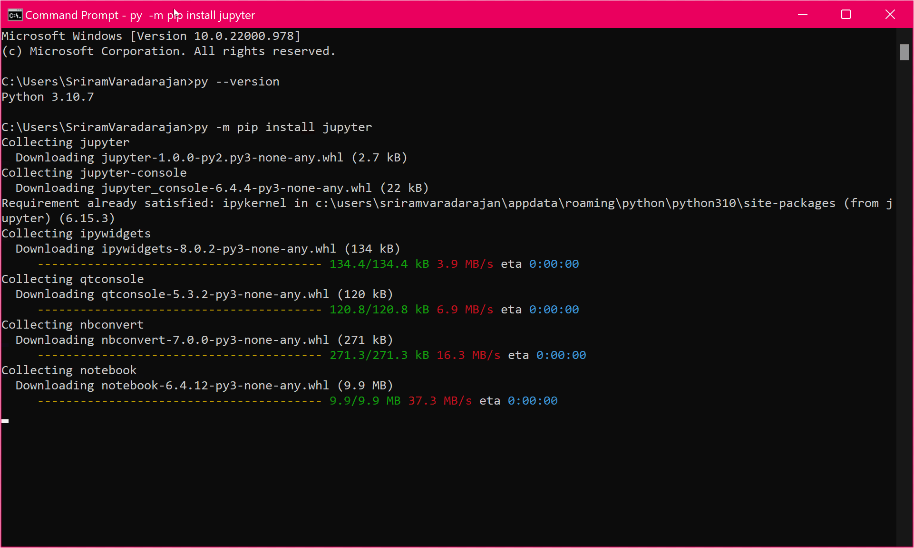
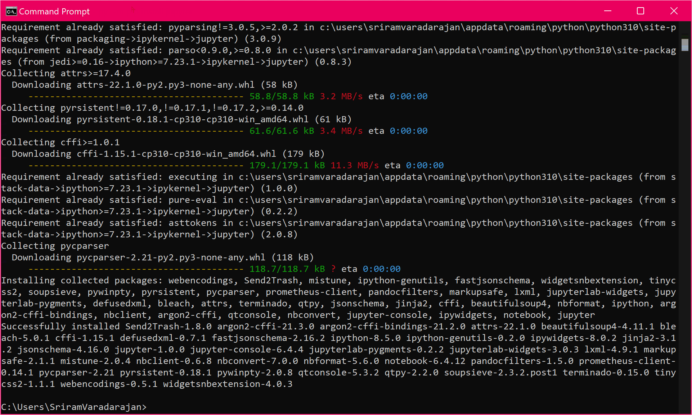

# Python Setup on Windows

Only complete these steps if Python isn't already installed!

## Downloading Python

We will download the Python installer file from the Python website (https://www.python.org/downloads/windows).

> :memo: **Note**  
> The current stable version of Python (as of September 2022) is Python 3.10.xx. Note, this may be different at the time of reading but we are looking for the Latest Python 3 Release. 

  

Clicking on the link highlighted in red will take us to the following page 

  

In this page, click on the Windows Installer (64-bit) which will download the installer file on to your computer.

**Note**: By default, this will be downloaded to your Downloads folder. 

  

## Installing Python

Double click on this file to start the installation process. 

  

In the installation window (see screenshot above), choose the options as mentioned below:

- [ ] (**Untick**) "Install launcher for all users (recommended)"
- [x] (**Tick**) " Add Python 3.10 to PATH"

After making these changes, click on "Install Now". This should typically install Python 3.10 to "C:\Users\\\<username\>\AppData\Local\Programs\Python\Python310" where \<username\> is your Windows username. For example, for a user called JohnSmith, this will be "C:\Users\JohnSmith\AppData\Local\Programs\Python\Python310".

If your installation window displays another folder, make a note of this folder path.

After the installation is complete, you should see the following screen. 

  

Click on **"Close"** to complete the installation. 

## Verifying Python installation

Click on Start and search for Command Prompt and open the app.

  

In the Command Prompt window, type the following `python --version` (i.e. python followed by a space followed by double dashes and version) or `py --version` and hit Enter.

> :memo: **Note**  
>  On Windows computers, `python ...` or `py ...` commands will both work, however, on UNIX or MacOS computers, only `python ...` commands will work. 

If the commands do not work, then it means the Python executable file is not added to PATH environment variable.

If Python was installed correctly, you should see the Python version (same as the version we downloaded from python.org) displayed on screen.

  

## Install Jupyter to run Python in notebooks 

Jupyter notebooks (https://jupyter.org/) provide an accessible interface that makes it easy to learn Python as we get instantaneous visual feedback on the Python code snippets we execute. Jupyter notebooks are also widely used by data scientists and data analysts to run experiments, analyse data etc. and Jupyter notebooks can also be used with other programming languages such as Julia and R. 

We can install jupyter from the command prompt using the command `python -m pip install jupyter` or `py -m pip install jupyter`. Type this command in the command prompt window and hit Enter. This should install the required packages and you should see a message at the end that says "Successfully installed ...".

  

  

## Summary

- Download the Windows Installer (64-bit) for the Latest Python 3 Release
- Install it on your computer with the following options:
  - [ ] Install launcher for all users
  - [x] Add Python to PATH
- Verify the installation by opening Command Prompt and running `python --version`
- Install jupyter by running `python -m pip install jupyter` in Command Prompt.
