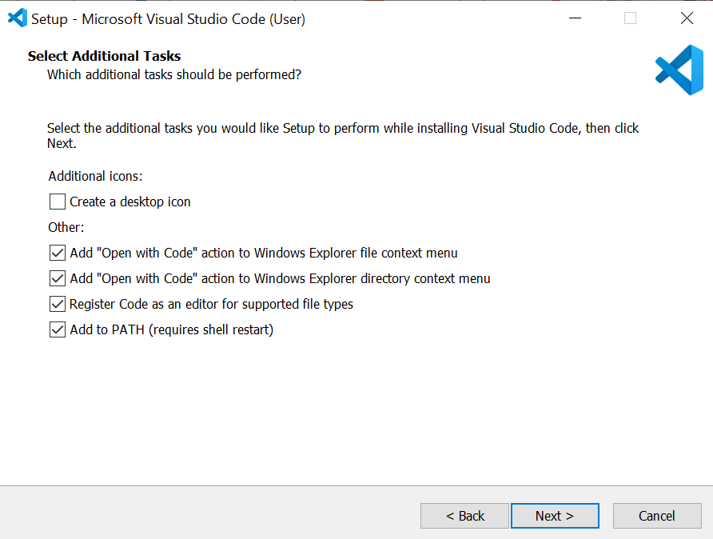

# VS Code

VS Code is a lightweight, but extendable text editor that is very popular in industry for all types of programming.

## VS Code Download
 
To install the desktop app follow this [link](https://code.visualstudio.com/download) and select the correct option for your OS.

Follow the set up wizard, **accepting** the license agreement, and **accepting** the defaults, **until** you get to this screen:

  

> Please select the `"Open with Code"` options, which allows us additional options when opening VS Code.

To test the install, open a command prompt (type `cmd` in the Windows Start Menu) and type the following command:

`code --version`
