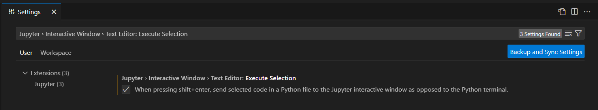

# Python Files

## From Jupyter Notebooks to Python Files
Jupyter Notebooks ('.ipynb') offer an excellent interactive learning environment for Python, allowing code execution in cells with immediate output, as well as neighbouring markdown cells for detailed explanation of code. 

However, as our Python projects grow larger and more complex, and as we move towards deploying our code in production environments, it's beneficial to organise our code into Python files ('.py') for several reasons:

1. **Clearer Separation of Concerns**: Python files facilitate breaking down complex systems into manageable parts, such as separating calculation logic from user interface code.

2. **Improved Reusability**: Code stored in Python files is easily reusable across multiple files and projects.

- **Enhanced Version Control**: Python files are also better suited for version control systems like Git. 

- **Better Testing and Debugging**: Python files enable the use of standard debugging tools, automated tests, and static code analysis, ensuring code works as expected and errors are caught early.

- **Predictable Execution Environment**: Python files offer a clean execution environment with each run, preventing unexpected behavior caused by variable state persistence in Jupyter Notebook cells. For example, if a variable is accidentally modified in one cell, it can impact the execution of code in subsequent cells. Versues, when we run code from a Python file, each execution starts with a clean slate. 

- **Standard Practice for Deployment**: Lastly, organising code into Python files is standard practice for deployment in larger applications or systems. Essentially it makes it easier to package, distribute, and deploy our code alongside other components of the application.


## Executing a Simple Python File
There are various methods to execute a Python file, such as using the command line (i.e running the file as a Script) or importing it into another Python file (i.e running the file as a Module). We will delve into the latter method later, so for now, let's focus on executing Python files as a Script. To execute a Python file as a Script:
1. From the command line, navigate to the directory where your Python file is located.
2. **Run the Python File**: Use the `python` command followed by the name of your Python file to execute it:
```
python your_file.py
```
Replace `your_file.py` with the name of your Python file.

This is using a relative path, alternatively, you can use an absolute path to execute Python files located outside of the current directory:
```
python /path/to/your_file.py
```
Replace `/path/to/your_file.py` with the absolute path to your Python file. 

## Using VS Code's Interactive Window
VS Code offers a solution for maintaining interactivity when working with Python files, by integrating Jupyter functionality into Python files. This is achieved through its Interactive window feature. To use the Interactive window, you can do either of the following:

- Use the keyboard shortcut `Shift+Enter` while having a Python file open to execute the current selection or line in the Interactive window. **Note**: you will need to ensure in Settings, (`Ctrl+,`), `Jupyter › Interactive Window › Text Editor: Execute Selection` is ticked. 



- Use `#%%` comment tags within your Python file to indicate code cells, allowing you to execute individual cells in the Interactive window. When the Python detects a code cell, it adds `Run Cell`, `Debug Cell` and `Run Below` or `Run Above`, depending on whether it's the first or subsequent cell indicated in the Python file. Selecting a command runs the cell in the interactive window
